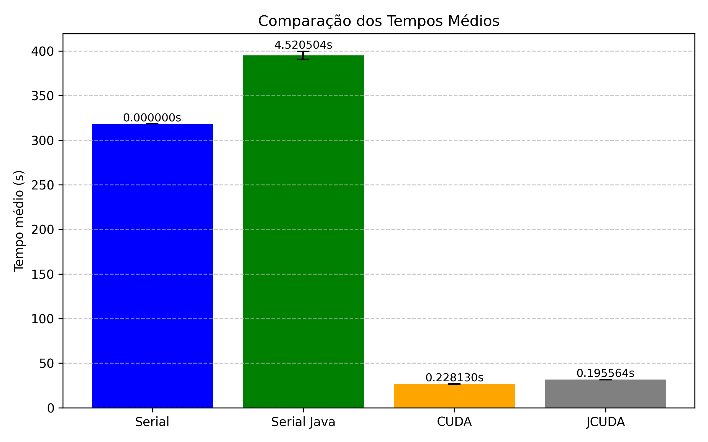
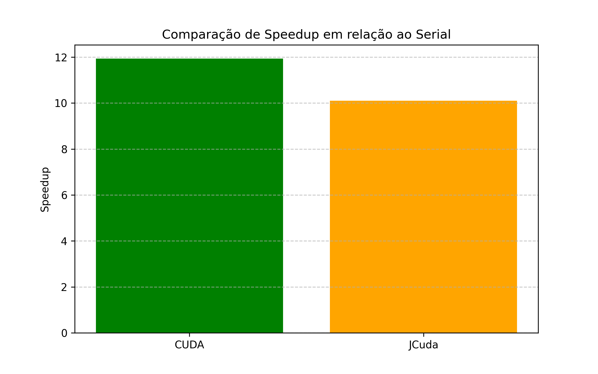
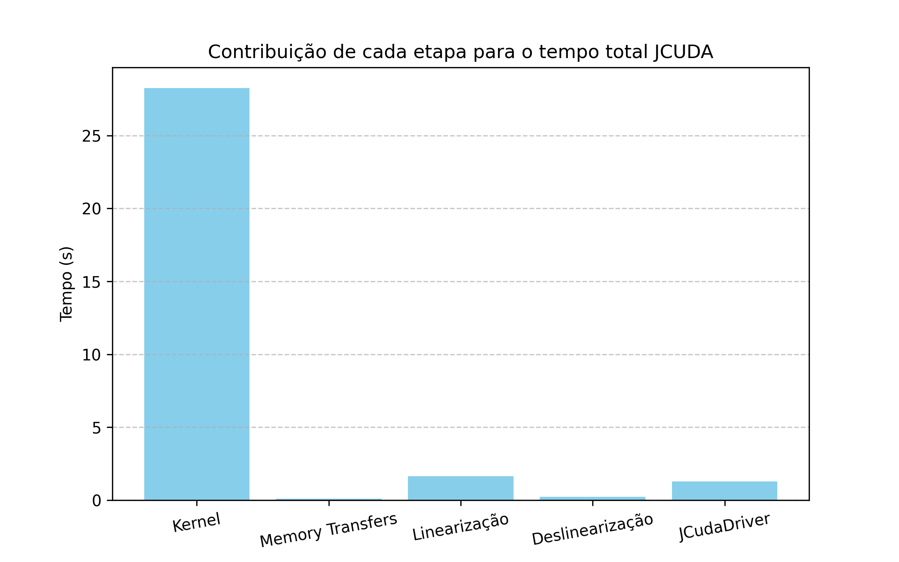
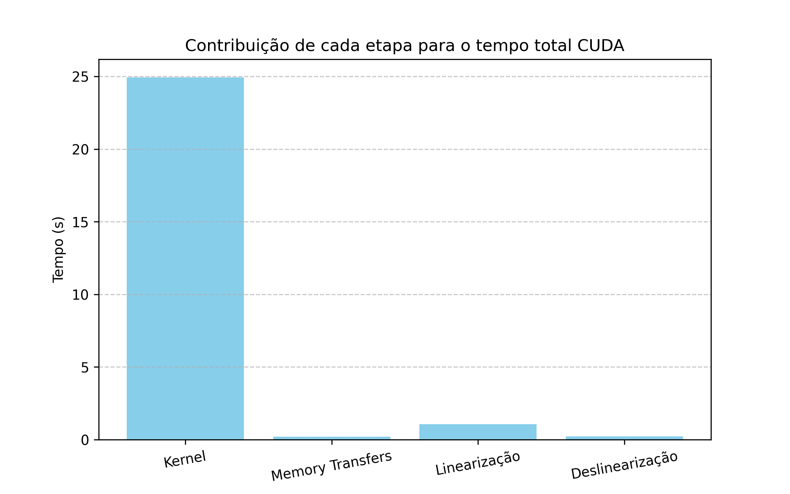

# Seminario Java e GPU

## ALOCAR GPU
```bash
srun --time 60 --mem 3000 --cpus-per-task 1 --gpus 1 --pty bash -i
module load cuda/11.8 gcc/11.3 g++/11.3
module available 
```

## BAIXAR JDK E MAVEN
```bash 
chmod +x run.sh
./run.sh
```

## APONTAR O JAVA_HOME
```bash
export JAVA_HOME=<YOUR_PATH>/jcuda-samples/libs/openlogic-openjdk-8u462-b08-linux-x64
export PATH=$JAVA_HOME/bin:$PATH

source ~/.bashrc
```

## COMPILAR O PROJETO
```bash
../libs/apache-maven-3.9.11/bin/mvn clean compile
```

## EXECUTAR O EXEMPLO QUE DESEJA
```bash 
../libs/apache-maven-3.9.11/bin/mvn exec:java -Dexec.mainClass=serial.matrixmultiplication.MatrixMultiplication -DDEBUG=true -DTIMER=true -DWORKLOAD=G

../libs/apache-maven-3.9.11/bin/mvn exec:java -Dexec.mainClass=jcuda.matrixmultiplication.JCudaMatrixMultiplication -DTIMER=true -DWORKLOAD=G
```

## Report

Neste trabalho estão implementadas as versão paralelas de uma multiplicação de matrizes utilizando Java com JCUDA e CUDA. Além disso temos a versão sequencial 
em C e Java.

## Descrição do Ambiente de Testes

- SO: Debian 6.1.148-1
- Kernel Linux: Linux slurm-head 6.1.0-39-amd64
- CPU: Intel(R) Xeon(R) CPU E5-2620 0 @ 2.00GHz
- GPU: NVIDIA TITAN Xp
- Versões de Software:
  - Compilador: GCC 11.3 G++ 11.3
  - CUDA: 11.8
  - JDK: 8
  - Maven: 3.9


#### Tempo médio de execução total 
Comparação dos tempos médios de cada versão, serial em C, serial em Java, CUDA, Java com JCUDA. <br/>

Nas versões sequenciais o tempo de execução do Java foi de 390s aproximadamente, tendo um desvio padrão de 1.52050s. A versão sequencial em C teve um tempo de 316s. <br/>

A versão de CUDA teve um tempo de 26s aproximadamente, com um desvio padrão de 0.2281s. A versão de Java com JCuda teve um tempo de 31s aproximadamente com um desvio padrão de 0.1955s. <br/>
O tempo de execução maior na versão com JCuda ocorre porque as chamadas da API Java funcionam como uma camada de ligação (binding) sobre o código nativo em C/C++ e o Java não possui acesso direto à GPU, dependendo dessa conversão para utiliza-lá.


 

#### Speedup
O speedup foi calculado com base na versão serial em C <br/>
A versão com CUDA teve melhor speedup, cerca de 11.93 vezes, já a versão utilizando JCuda teve um speedup de 10.01 vezes.



#### Tempo por etapa de execução
Foi medido o tempo para cada etapa de execução, com objetivo de verificar onde estão os gargalos e se tem como melhorar na etapa de maior duração. <br/>
Os tempos medidos foram: <br/>
  Memory Transfers<br/>
  Kernel <br/>
  Linearização <br/>
  Deslinearização <br/>
  JCudaDriver (se aplicavel)  <br/>


